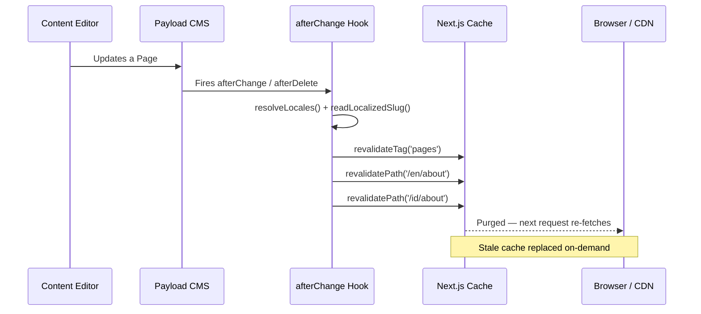

<div align="center">


</div>

<br />

# Ian Febi Sastrataruna — Personal Portfolio

A blazing-fast, fully internationalized personal portfolio & blog built with **Next.js 16 App Router** and **Payload CMS 3.x** as the headless content engine. Features on-demand ISR, tag-based cache revalidation, and a rich content editing experience.

> **Live site:** [https://www.ianfebisastrataruna.my.id](https://www.ianfebisastrataruna.my.id)

---

## Features

- **Next.js 16** with App Router & React Server Components
- **Payload CMS 3.x** — self-hosted headless CMS with a polished admin UI
- **Fully internationalized** — English (en) & Indonesian (id) via `next-intl`
- **Tailwind CSS** with a custom design system
- **Cloudinary** for optimized image delivery & transformations
- **Rich animations** — Framer Motion, GSAP, Lenis smooth scrolling, Swiper carousels
- **Lexical rich-text editor** with SEO plugin inside Payload
- **ApexCharts** — interactive charts for skill visualizations
- **Docker-ready** — multi-stage builds with standalone output
- **ISR with on-demand revalidation** — instant cache purges when content changes

---

## Tech Stack

| Layer | Technology |
|---|---|
| **Framework** | [Next.js 16](https://nextjs.org/) (App Router) |
| **CMS** | [Payload CMS 3.x](https://payloadcms.com/) |
| **Database** | MongoDB via `@payloadcms/db-mongodb` |
| **Language** | TypeScript |
| **Styling** | Tailwind CSS 3 + SCSS modules |
| **i18n** | [next-intl](https://next-intl-docs.vercel.app/) |
| **Media** | [Cloudinary](https://cloudinary.com/) via `payload-cloudinary` |
| **Rich Text** | Lexical (`@payloadcms/richtext-lexical`) |
| **Animations** | Framer Motion · GSAP · Lenis · Swiper |
| **Charts** | ApexCharts (`react-apexcharts`) |
| **Client State** | TanStack React Query |
| **Forms** | Formik + Yup |
| **Deployment** | Docker · VPS (standalone Node.js server) |
| **Package Manager** | pnpm |

---

## Getting Started

### Prerequisites

- **Node.js** ≥ 18
- **pnpm** ≥ 8
- **MongoDB** instance (local or Atlas)
- **Cloudinary** account (for media uploads)

### Environment Variables

Copy `.env.example` (or create `.env.local`) and fill in the following:

```bash
# Database
DATABASE_URL=mongodb+srv://<user>:<pass>@cluster.mongodb.net/web-profile

# Payload
PAYLOAD_SECRET=your-super-secret-key

# Cloudinary
CLOUDINARY_CLOUD_NAME=your-cloud-name
CLOUDINARY_API_KEY=your-api-key
CLOUDINARY_API_SECRET=your-api-secret
CLOUDINARY_FOLDER=web-profile-payload

# App
BASE_URL=http://localhost:3000
NEXT_PUBLIC_BASE_URL=http://localhost:3000
```

### Install & Run (Development)

```bash
# Install dependencies
pnpm install

# Start the Next.js dev server
pnpm dev
```

Open [http://localhost:3000](http://localhost:3000) — the frontend is ready.

To access the Payload admin panel, navigate to [http://localhost:3000/admin](http://localhost:3000/admin).

### Run Payload in Standalone Mode (optional)

```bash
pnpm payload
```

---

## Docker Deployment

Production-ready multi-stage Docker build with `output: 'standalone'`.

### Production

```bash
docker compose -f docker-compose.yml -f docker-compose.prod.yml up -d --build
```

### Staging

```bash
docker compose -f docker-compose.yml -f docker-compose.staging.yml up -d --build
```

The Dockerfile uses two stages:

1. **Builder** — installs deps with pnpm, runs `pnpm build`
2. **Runner** — copies only `.next/standalone`, `public/`, and `.next/static` into a slim Alpine image

> The container listens on port `3000` internally. The included compose file maps it to `3001` on the host behind an external Traefik/Caddy proxy network.

---

## ISR & Cache Revalidation Architecture

This project leverages Next.js **Incremental Static Regeneration (ISR)** with **on-demand tag/path-based revalidation** to keep cached pages fresh without a full rebuild.

### How It Works

Every public-facing data fetch is wrapped in `unstable_cache` with descriptive **cache tags**:

```ts
// utils/get-page-by-slug.ts
const getPageBySlugCached = unstable_cache(
  async (slug, lang) => { /* Payload query */ },
  ['page-by-slug'],
  { tags: ['pages'] }  // ← cache tag
)
```

When content is created, updated, or deleted in Payload, collection `afterChange` / `afterDelete` hooks fire the revalidation utility:

```ts
// collections/Pages.ts
hooks: {
  afterChange: [({ doc, req }) => {
    revalidateContent({
      tags: ['pages'],          // invalidates unstable_cache by tag
      locales: ['en', 'id'],    // revalidates /en/* and /id/*
      paths: [`/en/${slug}`],   // revalidates specific page paths
    })
  }]
}
```

### Revalidation Flow



### What Gets Revalidated

| Content Type | Tags Invalidated | Paths Revalidated |
|---|---|---|
| **Pages** | `pages` | `/[locale]/[slug]` |
| **Articles** | `articles` | `/[locale]/article`, `/[locale]/article/[slug]` |
| **Projects** | `projects` | `/[locale]/[slug]` |
| **Home Page** | `home-page`, `pages` | `/en`, `/id` |
| **Sitemap** | — | `/sitemap.xml` (on every mutation) |

The `revalidateContent()` utility (in `lib/revalidate.ts`) automatically:
- Iterates over all supported locales (`en`, `id`)
- Calls `revalidateTag()` for the Next.js Data Cache
- Calls `revalidatePath()` for the full route cache
- Regenerates `sitemap.xml` to keep search engines in sync

This ensures **instant content updates** — as soon as you hit "Save" in Payload, the affected pages are purged and re-rendered on the next visit.

---

## Project Structure

```
├── app/                    # Next.js App Router
│   ├── (frontend)/         # Public-facing routes (i18n)
│   └── (payload)/          # Payload admin & API routes
├── blocks/                 # Payload block components
├── collections/            # Payload collections (Pages, Articles, etc.)
├── components/             # React UI components
│   ├── Cards/              # Article & portfolio cards
│   ├── Content/            # Content block renderers
│   ├── Layouts/            # Header, footer, sidebar
│   └── UI/                 # Reusable primitives
├── globals/                # Payload globals (Site, Profile, HomePage)
├── hooks/                  # Custom React hooks
├── i18n/                   # next-intl configuration & messages
│   └── messages/           # en.json, id.json
├── lib/                    # Core utilities
│   ├── revalidate.ts       # ISR revalidation logic
│   ├── constants.ts        # React Query defaults
│   └── api/                # API helper functions
├── utils/                  # Data-fetching wrappers (cached)
├── public/                 # Static assets
├── Dockerfile              # Multi-stage production build
├── docker-compose.yml      # Base compose config
├── docker-compose.prod.yml # Production overrides
└── docker-compose.staging.yml
```

---

## Scripts

| Command | Description |
|---|---|
| `pnpm dev` | Start Next.js dev server |
| `pnpm build` | Production build |
| `pnpm start` | Start production server |
| `pnpm lint` | Run ESLint |
| `pnpm payload` | Run Payload in standalone mode |
| `pnpm db:backup` | Backup MongoDB |
| `pnpm db:restore` | Restore MongoDB backup |

---

## Internationalization

The site supports **English** (`en`) and **Indonesian** (`id`) using `next-intl`. All Payload collections use localized fields — editors can write content in both languages from the admin panel. The middleware in `i18n/routing.ts` handles automatic locale detection and redirects.

---

## License

MIT © [Ian Febi Sastrataruna](https://www.ianfebisastrataruna.my.id)
